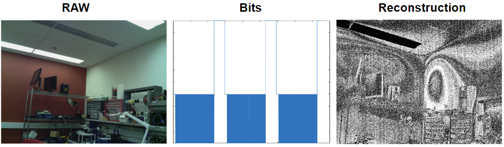

# EM Eye 

This repository is the tutorial of eavesdropping on camera video from camera circuit's electromagnetic (EM) leakage, which is presented in the NDSS'24 paper "**EM Eye: Characterizing Electromagnetic Side-channel Eavesdropping on Embedded Cameras**" (contact: yanlong@umich.edu and/or qhjiang@zju.edu.cn). Please also refer to [the research project introduction website](https://emeyeattack.github.io/Website/). 


To enable researchers to quickly reproduce the observations in the paper on different camera devices, we modified the [TempestSDR](https://github.com/martinmarinov/TempestSDR) tool into **[TempestSDR_EMEye](#sdr_bom)**. Specifically, range of eavesdropping parameters was adjusted to fit the scope of embedded cameras. 

To help readers understand how this eavesdropping process works, we also provide a **[MATLAB simulation program](#matlabsimulation_emeye)**.  


<a id="sdr_bom"></a>
##  TempestSDR_EMEye: Bill of Materials 

**Hardware**:
- A decent laptop
- Software-defined radio: Ettus USRP B210 USRP
- Low noise amplifier: Foresight Intelligence FSTRFAMP06
- Antenna: A common outdoor Log-periodic directional antenna (LPDA) for long distances or a cheap near-field magnetic field probe for short distances. 

Note that most hardware models can be changed. For example, the USRP can be replaced by cheaper SDR devices such as RTL-SDR. If you have expertise in software-defined radio, feel free to try different sets of hardware equipment. 

**Software**:
- Operating System: Ubuntu/macOS/Debian (Bookworm)
- UHD 4.4.0.0 driver [provided by Ettus Research](https://files.ettus.com/manual/page_install.html)
- libuhd-dev 4.4.0
- openjdk-8-jdk or OpenJDK 17.0.10
- TempestSDR_EMEye in this repo. Compile it by running "make all JAVA_HOME=/usr/lib/jvm/java-8-openjdk-amd64/" (change the path to your own jdk path) in the the JavaGUI/ folder

We suggest keeping the software models the same as ours. If you are compiling TempestSDR_EMEye with other software environments, you should read the instructions on the [TempestSDR](https://github.com/martinmarinov/TempestSDR) page. 

Make sure [your USRP is connected and you successfully ping it](https://files.ettus.com/manual/page_usrp2.html). Now the test environment is all set up.

##  TempestSDR_EMEye: Usage 

You can go to the JavaGUI/ folder and start TempestSDR_EMEye by running "java -jar JTempestSDR.jar". You will see the GUI pop up. Go to File -> Load USRP (via UHD), and input "--rate=10000000" to set the sampling rate to 10 MHz. Then configure the eavesdropping reconstruction algorithm by setting Disp Width, Real Height, FPS, and Freq based on this table below. 

**Tested Devices:**  

| **No.** | **Vendor and Model**                   | **Disp Width** | **Real Height** | **FPS**     | **Freq. (MHz)** | 
|:-------:|:----------------------------:|:--------------:|:---------------:|:-----------:|:---------------:|
| **1**   | Raspberry Pi Camera Module 1 | 2576           | 1126            | 30.01985577 | 204 or 255        |
| **2**   | Raspberry Pi Camera Module 2 | 2576           | 1790            | 29.55323582 | 457 or 570        |
| **3**   | Raspberry Pi Camera Module 3 | 2166           | 1244            | 30.08283973 | 335 or 1015       |
| **4**   | Google Pixel 1               | 2800           | 1557            | 29.89235398 | 600 or 1649       |
| **5**   | Google Pixel 3               | 6000           | 3055            | 30.0610185  | 515 or 680        |
| **6**   | Samsung S6                   | 5000           | 3173            | 30.01527799 | 527 or 1054       |
| **7**   | ZTE Z557                     | 4000           | 2453            | 23.98017526 | 522 or 1740       |
| **8**   | Wyze Cam  Pan 2              | 2300           | 1687            | 20.0071563  | 890 or 1185       |
| **9**   | Xiaomi Dafang IP Camera      | 2567           | 2250            | 15.0008813  | 322 or 890        |
| **10**  | Baidu Xiaodu X9              | 2576           | 1250            | 15.0000375  | 204 or 1470       |
| **11**  | TeGongMao                    | 2576           | 1500            | 15.15164801 | 763 or 1144       |
| **12**  | Goov V9                      | 2000           | 750             | 30.30325987 | 546 or 656        |
| **13**  | QiaoDu                       | 2576           | 2245            | 15.04149722 | 293 or 1191       |
| **14**  | 360 M320 Dashcam             | 2620           | 1818            | 25.00241735 | 450 or 1261       |
| **15**  | Blackview Dashcam            | 2567           | 1196            | 30.09970806 | 155 or 1015       |

The configuration parameters are for specific camera modes. You may need to adjust the parameters when testing other modes. 
- Raspberry Pi cameras were tested while they are in the 1080p mode (-md 1). 
- Smartphone cameras (rear/main cameras) were tested in the video mode. 
- Dash cams and home cameras were tested in their default modes. 

Note that individual devices of the same model may require slightly different parameters than the ones reported in the table due to hardware manufacturing and software version variations. You may need to fine-tune the frequency, FPS, and height, and even the SDR sampling rate to get the best results. The width parameter only controls the scaled aspect ratio of the displayed reconstruction and does not have any impact on the EM reconstruction process.  We refer you to the [dissertation of Martin Marinov](https://github.com/martinmarinov/TempestSDR/blob/master/documentation/acs-dissertation.pdf), the author of [TempestSDR](https://github.com/martinmarinov/TempestSDR), for more information on how these parameters work. 

**Eavesdropping GUI:**

Press the star button. You will see something similar to the figure below. The upper-left window displays the real-time reconstruction of the camera video. 


<a id="matlab"></a>
##  MatlabSimulation_EMEye

The simulation program is in the MatlabSimulation_EMEye/ folder of this repo. 

The program converts a RAW image frame (room.dng) captured by a Raspberry Pi Camera V1 into the bit stream transmitted over the MIPI CSI-2 2-lane interface used by the camera sensor, and then reconstructs the image from the simulated corresponding EM signals of the bit stream. 




##  Citation Information  
If you find our results useful to your research, please cite it as follows:


```
@inproceedings{long2024emeye,
    title={EM Eye: Characterizing Electromagnetic Side-channel Eavesdropping on Embedded Cameras},
    author={Long, Yan and Jiang, Qinhong and Yan, Chen and Alam, Tobias and Ji, Xiaoyu and Xu, Wenyuan and Fu, Kevin},
    booktitle={Network and Distributed Systems Security (NDSS) Symposium},
    year={2024}
    }
```