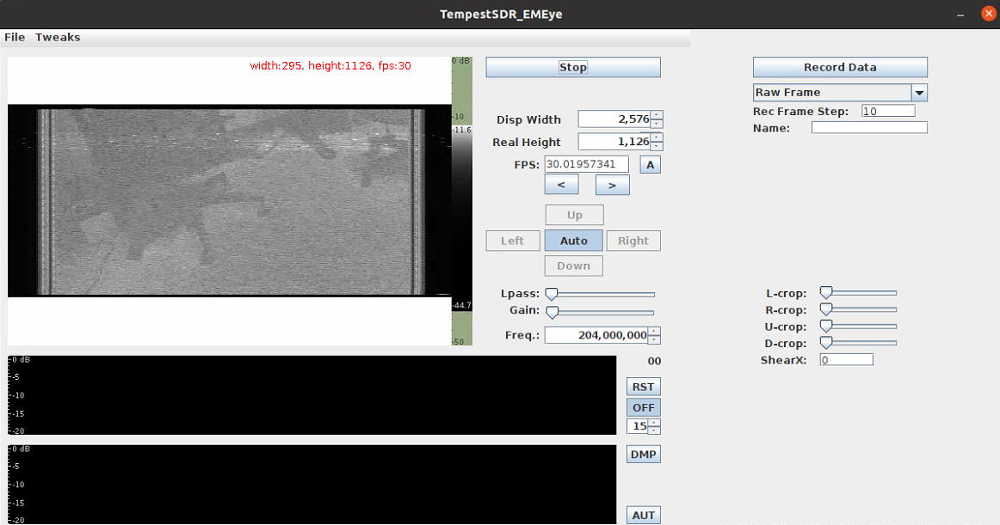

# EM Eye 

This repository is the tutorial of eavesdropping on camera video from camera circuit's electromagnetic (EM) leakage, which is presented in the NDSS'24 paper "**EM Eye: Characterizing Electromagnetic Side-channel Eavesdropping on Embedded Cameras**"

To enable researchers to quickly reproduce the observations in the paper, we modified the [TempestSDR](https://github.com/martinmarinov/TempestSDR) tool into **TempestSDR_EMEye**. 

##  Bill of Materials 

**Hardware**:
- A decent laptop
- Software-defined radio: Ettus USRP B210 USRP
- Low noise amplifier: Foresight Intelligence FSTRFAMP06
- Antenna: A common outdoor Log-periodic directional antenna (LPDA) for long distances or a cheap near-field magnetic field probe for short distances. 

Note that most hardware models can be changed. For example, the USRP can be replaced by cheaper SDR devices such as RTL-SDR. If you have expertise in software-defined radio, feel free to try different sets of hardware equipment. 

**Software**:
- Operating System: Ubuntu/macOS
- UHD 4.4.0.0 driver [provided by Ettus Research](https://files.ettus.com/manual/page_install.html)
- libuhd-dev 4.4.0
- openjdk-8-jdk
- TempestSDR_EMEye in this repo. Compile it by running "make all JAVA_HOME=/usr/lib/jvm/java-8-openjdk-amd64/" (change the path to your own jdk path) in the the JavaGUI/ folder

We suggest keeping the software models the same as ours. If you are compiling TempestSDR_EMEye with other software environments, you should read the instructions on the [TempestSDR](https://github.com/martinmarinov/TempestSDR) page. 

Make sure [your USRP is connected and you successfully ping it](https://files.ettus.com/manual/page_usrp2.html). Now the test environment is all set up.

##  Usage 

You can go to the JavaGUI/ folder and start TempestSDR_EMEye by running "java -jar JTempestSDR.jar". You will see the GUI pop up. Go to File -> Load USRP (via UHD), and input "--rate=10000000" to set the sampling rate to 10 MHz. Then configure the eavesdropping reconstruction algorithm by setting Disp Width, Real Height, FPS, and Freq based on this table below. 

| **No.** | **Vendor and Model**                   | **Disp Width** | **Real Height** | **FPS**     | **Freq. (MHz)** |
|:-------:|:----------------------------:|:--------------:|:---------------:|:-----------:|:---------------:|
| **1**   | Raspberry Pi Camera Module 1 | 2576           | 1126            | 30.01985577 | 204, 255        |
| **2**   | Raspberry Pi Camera Module 2 | 2576           | 1790            | 29.55323582 | 457, 570        |
| **3**   | Raspberry Pi Camera Module 3 | 2166           | 1244            | 30.08283973 | 335, 1015       |
| **4**   | Google Pixel 1               | 2800           | 1557            | 29.89235398 | 600, 1649       |
| **5**   | Google Pixel 3               | 6000           | 3055            | 30.0610185  | 515, 680        |
| **6**   | Samsung S6                   | 5000           | 3173            | 30.01527799 | 527, 1054       |
| **7**   | ZTE Z557                     | 4000           | 2453            | 23.98017526 | 522, 1740       |
| **8**   | Wyze Cam  Pan 2              | 2300           | 1687            | 20.0071563  | 890, 1185       |
| **9**   | Xiaomi Dafang IP Camera      | 2567           | 2250            | 15.0008813  | 322, 890        |
| **10**  | Baidu Xiaodu X9              | 2576           | 1250            | 15.0000375  | 204, 1470       |
| **11**  | TeGongMao                    | 2576           | 1500            | 15.15164801 | 763, 1144       |
| **12**  | Goov V9                      | 2000           | 750             | 30.30325987 | 546, 656        |
| **13**  | QiaoDu                       | 2576           | 2245            | 15.04149722 | 293, 1191       |
| **14**  | 360 M320 Dashcam             | 2620           | 1818            | 25.00241735 | 450, 1261       |
| **15**  | Blackview Dashcam            | 2567           | 1196            | 30.09970806 | 155, 1015       |

Then press the star button. You will see something similar to the figure below. The upper-left window displays the real-time reconstruction of the camera video. 

